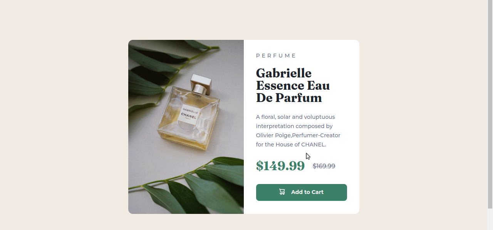

# Frontend Mentor - Product preview card component solution

This is a solution to the [Product preview card component challenge on Frontend Mentor](https://www.frontendmentor.io/challenges/product-preview-card-component-GO7UmttRfa). Frontend Mentor challenges help you improve your coding skills by building realistic projects. 

## Table of contents

- [Overview](#overview)
  - [The challenge](#the-challenge)
  - [Screenshot](#screenshot)
  - [Links](#links)
- [My process](#my-process)
  - [Built with](#built-with)
  - [What I learned](#what-i-learned)
  - [Continued development](#continued-development)
  - [Useful resources](#useful-resources)


## Overview

Building a product preview card component and making it look as close to the given design as possible using only the jpg images given in the design folder. 

### The challenge

Users should be able to:

- View the optimal layout depending on their device's screen size
- See hover and focus states for interactive elements

### Screenshot



### Links

- Solution URL: [https://github.com/osSidd/product_card](https://github.com/osSidd/product_card)
- Live Site URL: [https://ossidd.github.io/product_card/](https://ossidd.github.io/product_card/)

## My process

Using the given starter code, first I developed the HTML markup and then added CSS styles using the style guide document. At first I designed the card component only for the desktop environment, then I added the responsive behaviour. I regularly pushed my code to github using git.

### Built with

- Semantic HTML5 markup
- CSS custom properties
- Flexbox
- Mobile-first workflow

### What I learned

I learned how to develop an optimal image display for responsive sites using the picture and source tags, also I used the hsl color value for setting the background and font colors of different elements (used first time). 

```html
<picture>
	<source srcset="./images/desktop-img.jpg" media="(max-width:1440px)">
	<source srcset="./images/mobile-img.jpg" media="(max-width:375px)"> 
	
</picture>
```

### Continued development

Though I used the picture and source tag for optimal responsive display, I am still not very comfortable with the css properties associated with this tags. Thus I would continue to work on the css properties for styling specific html tags.

### Useful resources

- [w3schools](https://www.w3schools.com/) - This helped me to understand the css properties like flex, filter and html tags like picture and source. I really liked this pattern and will use it going forward. I'd recommend it to anyone still learning this concept.

